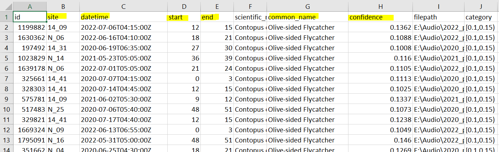

## BirdNET

After processing audio files with BirdNET, a detection table is generated. This table includes columns detailing where each detection occurred (file name, start time, and end time), the detected species name, and a "confidence" score. The confidence score ranges from 0.1 to 1, indicating the likelihood that a detection is accurate.



However, there is no established "threshold" for users to determine which detections to trust. Setting a high threshold can increase precision but may exclude valid detections, while a low threshold retains more detections but may lower precision. A species-specific threshold can be identified by creating a calibration curve that links BirdNET confidence scores to true positive probabilities, though this process requires a validated dataset.


## Validation

### Quick overview

All validation datasets are stored in a [Google Drive](https://drive.google.com/drive/folders/1y5mlKvnEp9t8HED9-M25pRX1BoReqx8V?usp=sharing), organized by species in individual folders. Each species folder includes recording segments (each 9 seconds long) and a .csv file named "SPECIES NAME_validation.csv" that serves as metadata for these segments. The segments are randomly selected from all detections for that species, stratified by confidence score. The validation task involves listening to each segment to verify if BirdNET correctly identified the species and writing down this information in the .csv file. To conduct species validation, follow these steps:

### Get data folder

-   Download the whole folder for the species that you selected to do

-   In the selected species folder, open the “SPECIES NAME_validation.csv” file. Add two new columns beside the category column labeled “validation” and “note.”

    

-   To avoid judgement bias, "hide" the confidence column by `right click > Hide`.

-   Listen to each recording and view the spectrogram if needed. Enter "Y" in the validation column if the BirdNET detection is accurate (e.g., e.g., Olive-sided Flycatcher is present in the recording). Enter "N" in the validation column iuf the detection is not accurate (e.g., no Olive-sided Flycatcher). Enter "U" if unsure.

-   Record notes if there is any special vocalizations (e.g., call, begging call, high quality signals) and/or possible reasons for misidentification (e.g., background noise, misidentified as XYZ species).

    -   Both [Xeno-Canto](https://xeno-canto.org/species/Contopus-cooperi?view=3) and [All About Birds](https://www.allaboutbirds.org/guide/Olive-sided_Flycatcher/sounds) have good examples of vocalizations.

### Use ShinyR to listen the audio/view spectrogram (optional)

-   Open RStudio, run the following chunk of code.

```{r, eval = FALSE}
# use install.packages("PACKAGE_NAME") if you don't have the following required packages installed yet

library(shiny) 
library(bslib)
library(shinyWidgets) 
library(shinyFiles)

library(tidyverse)
library(DT)
library(praise)

library(tuneR)
library(seewave)

shiny::runGitHub("Birds-Canada-ARU-2024", "SunnyTseng", subdir = "R")
```

-   An interface should pop up if all goes well. This interface required two entries:
    -   The .csv file that contains the meta data of the segments. This is the .csv file in the species folder that you downloaded from the Google Drive.
    -   The file path of the folder that contains the segments. This is the species folder that you downloaded.

| select meta data                     | select recording folder              |
|--------------------------------------|--------------------------------------|
|  |  |

-   The .csv file would be shown on the top panel (with few selected columns). Once you click on the "Spectrogram" button, the bottom panel would show the corresponded spectrogram. And if you click the "Audio" button, it would play that specific segment for you.

-   You can adjust the "Settings" on the left panel to view the spectrogram. Click on the "Praise me" button if you are feeling tired of validating sounds. 😃


### Wrap up

-   After completing all the segments, save your file as “SPECIES_NAME_validation_YOUR_INITIAL.csv”. Upload this .csv file to the same folder, or send the final document back to Sunny.
-   In the Google Drive main folder, there is a document "who_did_what.csv", which contains the full list of species, feel free to let me know the species you wanted to do next.

### Enjoy!
