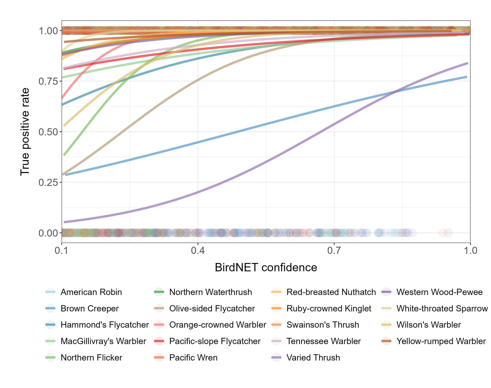

How to do BirdNET validation
================
Sunny Tseng
2024-11-15

## BirdNET Quick Review

After processing audio files with BirdNET, a detection table is
generated. This table includes columns detailing where each detection
occurred (file name, start time, and end time), the detected species
name, and a “confidence” score. The confidence score ranges from 0.1 to
1, indicating the likelihood that a detection is accurate.

However, there is no established “threshold” for users to determine
which detections to trust. Setting a high threshold can increase
precision but may exclude valid detections, while a low threshold
retains more detections but may lower precision. A species-specific
threshold can be identified by creating a calibration curve that links
BirdNET confidence scores to true positive probabilities, though this
process requires a validated dataset.

## Validation Steps

All validation datasets are stored in a [Google
Drive](https://drive.google.com/drive/folders/1y5mlKvnEp9t8HED9-M25pRX1BoReqx8V?usp=sharing),
organized by species in individual folders. Each species folder includes
up to 360 recording segments (each 9 seconds long) and a .csv file named
“SPECIES NAME_validation.csv” that serves as metadata for these
segments. The segments are randomly selected from all detections for
that species, stratified by confidence score. The validation task
involves listening to each segment to verify if BirdNET correctly
identified the species and writing down this information in the .csv
file.

To conduct species validation, follow these steps:

- In the species folder, download and open the “SPECIES
  NAME_validation.csv” file. Add two new columns beside the category
  column labeled “validation” and “note.”

  

- Listen to each recording and view the spectrogram if needed. If the
  BirdNET detection is accurate (e.g., Olive-sided Flycatcher is present
  in the recording), enter “Y” in the validation column. If it is not
  accurate (e.g., no Olive-sided Flycatcher was heard), enter “N.”

  - To avoid judgement bias, “hide” the confidence column by
    `right click > Hide`.

  - A helpful tip: sort the .csv file by ID to match the sequence of the
    segments in the folder.

  - Can try downloading the files or listening to them on browser to see
    which makes you more comfortable. I personally liked to download
    them as it’s quicker if I need to check the spectrogram in Audacity.

- Record notes if there is any special vocalizations (e.g., call,
  begging call, high quality signals) and/or possible reasons for
  misidentification (e.g., background noise, misidentified as XYZ
  species).

  - Both
    [Xeno-Canto](https://xeno-canto.org/species/Contopus-cooperi?view=3)
    and [All About
    Birds](https://www.allaboutbirds.org/guide/Olive-sided_Flycatcher/sounds)
    have good examples of vocalizations.

- After completing all the segments, save your file as
  “SPECIES_NAME_validation_YOUR_INITIAL.csv” and upload it to the
  species folder.

## Updates

- [Here](https://github.com/SunnyTseng/thesis_aru_biodiversity_hotspot_V1/blob/main/data/Bird_list/species_list_final.csv)
  is the full list of species (122 species in total), feel free to let
  me know the species you wanted to do next. I will update the species
  recording segments on the Google Drive. (I didn’t upload all as the
  file size is too large)
- Let me know roughly how long it will take for you to finish each
  species. :)
